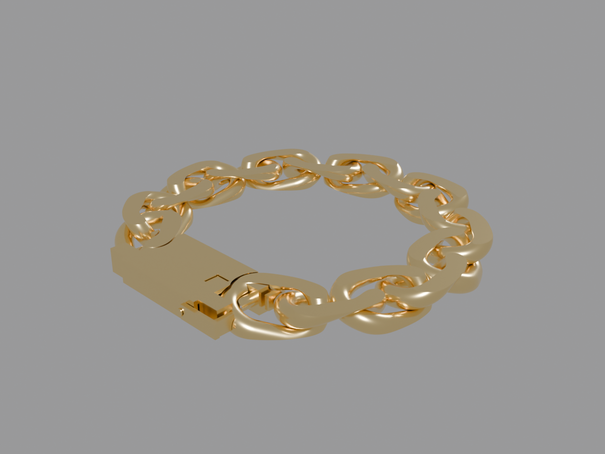
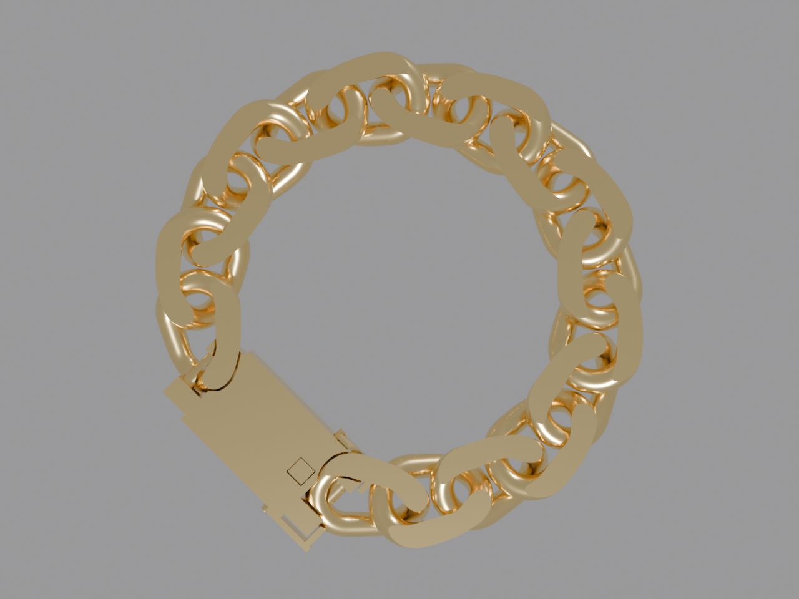
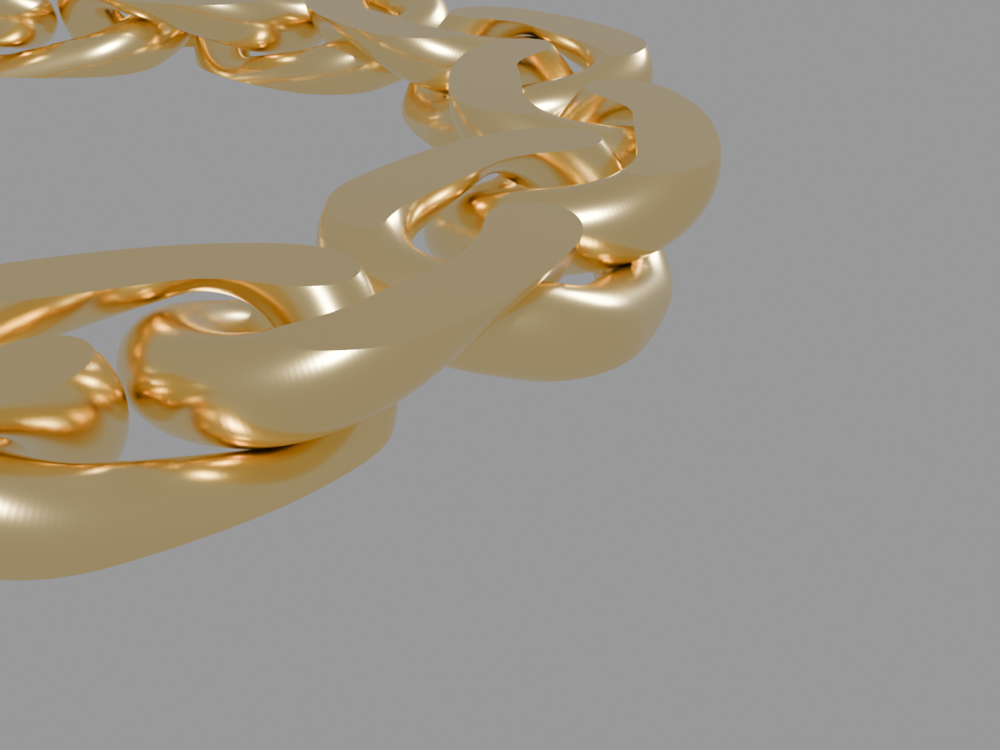

# claudeCAD

[](https://github.com/mdbritt/claudecad/actions/workflows/ci.yml)
[](LICENSE)

**A verification-first parametric CAD workspace built for designing with
[Claude Code](https://claude.com/claude-code).** You describe a piece; the
model writes parametric [build123d](https://github.com/gumyr/build123d)
code; geometry ships only after machine-checkable proofs pass — topological
interlock, zero-interpenetration, working mechanisms — and lands in your CAD
app (tested with Plasticity) as named, editable NURBS via STEP.



## Why this exists

LLMs are good at writing parametric geometry and bad at knowing when it's
wrong. claudeCAD's answer is a design loop where **verification is ground
truth and renders are not evidence**:

1. Dimensions live in one `params.py` per design.
2. `uv run python -m designs.<name>.build` builds solids and runs the gate:
   - **interlock** proven by the Gauss linking number of part centerlines,
   - **clearance** proven by exact boolean intersection (must be 0),
   - **mechanisms** proven by constructed states — e.g. a clasp tongue is
     built in relaxed AND compressed states; the gate asserts the compressed
     state slides free while the relaxed state is blocked (that differential
     *is* the click),
   - a failed gate blocks STEP export, period.
3. Headless Blender renders gold studio shots for the human judgment pass.
4. STEP export preserves part names for your CAD app's outliner.

The dated design docs in [`docs/superpowers/`](docs/superpowers/) carry the
evidence trail for every load-bearing decision — including OCCT construction
laws that took real adversarial testing to establish (why twisted closed
tubes must be built as overlapping half-loop ruled lofts; why `is_valid` is
necessary but nowhere near sufficient).

## Quickstart

```bash
git clone https://github.com/mdbritt/claudecad && cd claudecad
uv sync
uv run pytest                              # full verification suite
uv run python -m designs.simple_curb.build # build + verify a bracelet
```

View the result three ways:
- **Your CAD app**: import `out/step/simple_curb.step` (named parts).
- **Bundled web viewer**: `tools/step_viewer/fetch_libs.sh` once, then
  `python3 -m http.server 8123` from the repo root and open
  `http://localhost:8123/tools/step_viewer/?model=/out/step/simple_curb.step`.
- **Renders** (needs Blender, `BLENDER_BIN` to override the default path):
  `uv run python tools/render.py out/glb/simple_curb.glb --outdir out/renders/simple_curb`

## Using it with Claude Code

The repo ships a project skill (`.claude/skills/cad/SKILL.md`) that teaches
Claude the loop and its non-negotiable rules (mm-only params, never render
unverified geometry, never weaken a check, constructed-state mechanism
proofs). Open the repo in Claude Code and ask for a design; the skill does
the rest. Start a new piece from `designs/_template/` — the step-by-step
guide is [docs/new-design-recipe.md](docs/new-design-recipe.md).

## What's here

```
claudecad/            domain-neutral core
  core/               exact centerline math (planar + twisted)
  verify.py           the gate: linking number, intersection, path clearance
  jewelry/            DOMAIN PACK: links, chains, clasps, diamond-cut
  hardware/           DOMAIN PACK: carabiner (spring gate)
designs/              examples — each is params.py + build.py with a gate
tools/                STEP/GLB export, Blender renderer, web STEP viewer
docs/superpowers/     the evidence trail (specs + plans, dated)
```

## The benchmark

The system was battle-tested by designing a Miami cuban bracelet end to end
— twisted chirality-alternating links, chain-level diamond-cut, and a fully
functional box clasp (hinged safety latches, folded-spring tongue whose
click is *proven*, statically, by the relaxed-vs-compressed differential).




## Contributing

See [CONTRIBUTING.md](CONTRIBUTING.md). Short version: spec → plan → gate;
never weaken a check; new domains come as domain packs.

## License

Apache-2.0 — see [LICENSE](LICENSE).
